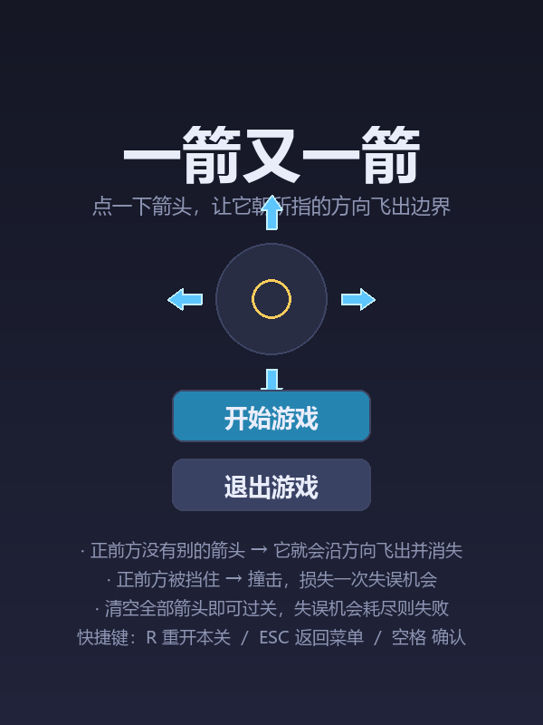
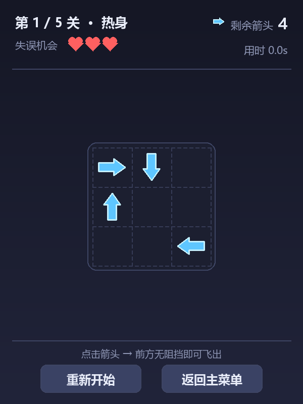
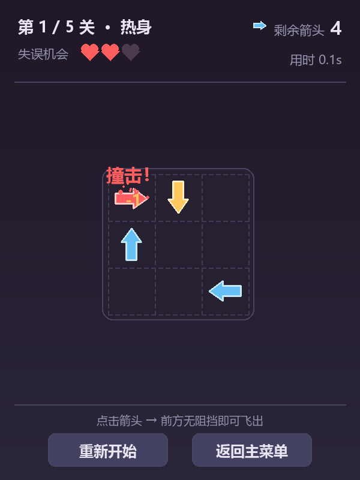
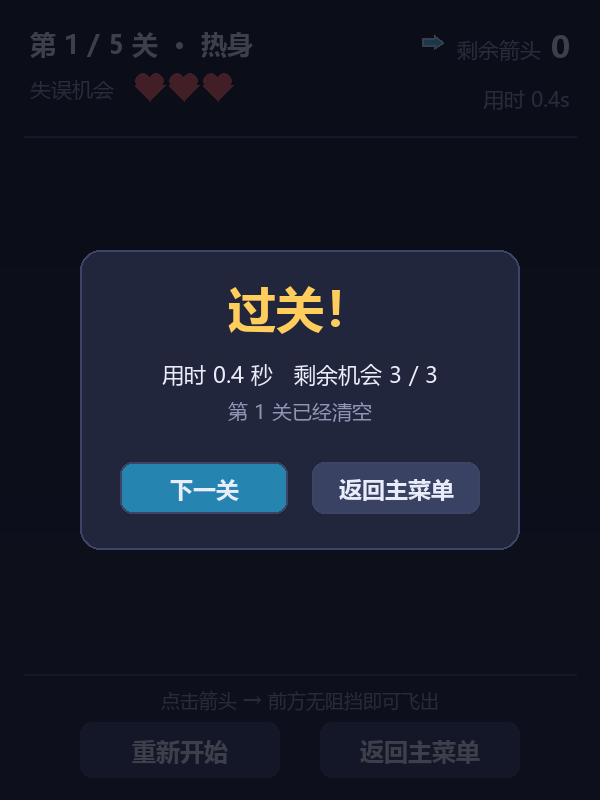
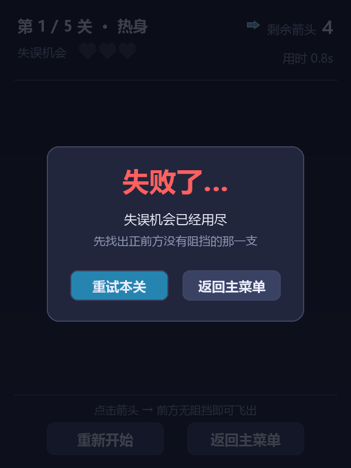
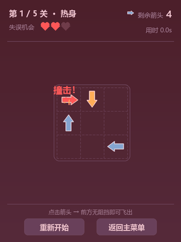

# 一箭又一箭（Arrow Escape）

一个用 **Python + Pygame** 编写的网格解谜小游戏：棋盘上散布着指向上下左右的箭头，点击箭头让它沿所指方向飞出边界；若正前方被其它箭头挡住，则发生撞击并消耗一次失误机会。清空全部箭头即可过关。

## 游戏简介

- 4 种方向的箭头，鼠标点击交互；
- 正确的路径检测：正前方至边界扫射，反方向箭头不算阻挡，边缘不会越界；
- 明显的碰撞反馈：抖动、变红、震屏、飘字、被撞箭头闪金；
- 失误机会机制（爱心图标实时显示），耗尽即失败；
- 内置 **5 个关卡**（热身 / 连锁 / 交错 / 迷宫 / 终章），全部经求解器校验必定可通关，难度递增；
- 通关自动进入下一关，任意时刻可重新开始。

## 开发环境

| 项目 | 版本 |
| :--- | :--- |
| 操作系统 | Windows 10/11 |
| Python | 3.10.11 |
| Pygame | 2.6.1 |

## 安装和运行方法

```bash
# 1. 安装依赖（任选其一）
pip install -r requirements.txt
# 或
pip install pygame

# 2. 运行游戏
python 1.py
```

附带两个无窗口命令入口（用于校验与自测）：

```bash
python 1.py --solve    # 校验全部关卡是否必定可通关，并打印通关顺序
python 1.py --test     # 自测核心规则（路径检测 / 胜负判定 / 状态机）
python 1.py --help     # 查看完整说明
```

## 运行所需的资源文件

- **游戏本体不依赖任何外部素材**：棋盘、箭头、心形失误图标、虚线网格全部由代码用 `pygame.draw` 现画，程序不会读取图片或音频文件。
- 中文界面直接调用**系统字体**（优先 `C:\Windows\Fonts\msyh.ttc` 微软雅黑），并按「字体文件 → 系统字体库 → pygame 内置字体」三级回退，因此无需随程序分发字体文件。
- 仓库中的 `screenshots/` 仅用于本 README 的截图展示与试玩演示，**不是程序运行所必需的资源**。
- 唯一的第三方依赖 pygame 记录在 `requirements.txt` 中。

## 游戏操作说明

| 操作 | 作用 |
| :--- | :--- |
| 鼠标左键点击箭头 | 该箭头沿所指方向飞出（前方无阻挡）或撞击（前方有阻挡，失误 -1） |
| `R` | 重新开始本关 |
| `ESC` | 返回主菜单 |
| `空格` / `回车` | 开始游戏 / 确认下一关 / 重试本关 |

## 游戏截图

开始界面：



游戏界面（第 1 关“热身”）：



撞击反馈：



通关界面：



失败界面：



完整试玩演示（第 1 关）：



## 代码结构

`1.py` 为单文件实现，按注释分段组织：

1. 基础常量与配色（方向编码、动画参数、状态机、配色、中文字体三级回退）
2. 关卡数据与可解性校验（`LEVELS`、`solve_level()`）
3. 核心逻辑（`Arrow` / `Level`，重点：`blocker_of()` 路径检测）
4. 绘制辅助（箭头精灵、心形、虚线、文字）
5. UI 组件（`Button`）
6. 特效（`Particle` / `FloatText`）
7. `Game` 状态机（菜单 / 游玩 / 胜利 / 失败）
8. 程序入口与测试（`--solve` / `--test`）

## 声明

本项目为课程作业，代码由本人编写并与 AIGC 工具（GitHub Copilot）协作完成，未使用原商业游戏《一箭又一箭》的代码、美术素材、音效或关卡。
